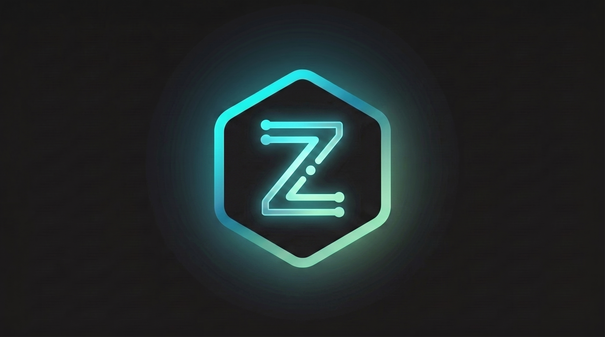

<div align="center">
  
</div>

# Zyne

A personal reading and focus app. One codebase, two deliberately different jobs:

**Phone — consuming.** A feed of ~60 curated sources ranked against your own interest profile, plus a bullet journal.
**Laptop — working.** A focus timer, a book-idea library, and the same journal. No news feed on the machine you work on.

Built with Tauri 2, vanilla JS and SQLite. No accounts, no server, no telemetry. Everything stays on your device.

---

## What it does

**Feed** *(phone)* — YouTube channels, subreddits, Hacker News, GitHub repos, Google News and any RSS, fetched in parallel and de-duplicated into a two-column card grid. Ranking runs locally by keyword against an interest profile you write in plain text; add an Anthropic API key and a batched Claude Haiku call does it better and adds a one-line hook per card. Either way the batch is capped and ends with a "you're caught up" card — no endless scroll.

**Focus** *(laptop; timer on both)* — one `+` button. Type what you're doing, press Enter, it runs; stop it and the session writes itself into today's journal. Four rhythms with a note on what each suits: Pomodoro 25/5, 52/17, a 90/20 deep block, and Flowtime which just counts up. Background sound and guided breathing sessions are separate roles, and a session is only offered when the break is long enough to hold it.

**Library** *(laptop; a Books chip on the phone)* — a discovery feed of **one idea per card**, extracted from book-summary feeds by pattern matching, no AI required. Save an idea and it becomes markdown; save the book and it joins a reading list that resurfaces during your timer breaks. You never type book data.

**Journal** — a bullet journal per day. Timed events live in SQLite with reminders; tasks and notes are markdown files using Obsidian's task syntax, including migrate (`- [>]`) and skip (`- [-]`).

## Your data

Everything markdown lands in `Documents/ZyneVault/`, so you can point Obsidian at it:

```
journal/2026-08-17.md   daily log — tasks, notes, focus sessions
reading-list.md         books you saved
ideas/                  idea cards you kept
clips/                  articles you clipped
```

## Running it

```bash
pnpm install
pnpm tauri dev                                     # desktop
pnpm tauri build                                   # Windows installer
pnpm tauri android build --apk --target aarch64    # phone
node zyne-app/src/js/focus-library.test.js         # self-check
```

Android signing is not in this repo — see [`zyne-app/README.md`](zyne-app/README.md) for how to set it up after a fresh clone.

## Notes if you're reusing this

The PIN lock is a convenience, not encryption — data on disk is unencrypted, and the PIN is chosen on first run and hashed into local storage, never committed. A six-digit hash is a 1,000,000-entry search, so committing one publishes the PIN.

Focus sounds use YouTube's official IFrame embed at 280×200. [Their policy](https://developers.google.com/youtube/terms/required-minimum-functionality) forbids hiding the player or playing audio-only, which is why there's no invisible background mode.

Book idea cards are the summariser's words about a book, not the book's own prose. Every card names its source and links to the full summary.

## License

MIT — see [LICENSE](LICENSE).
